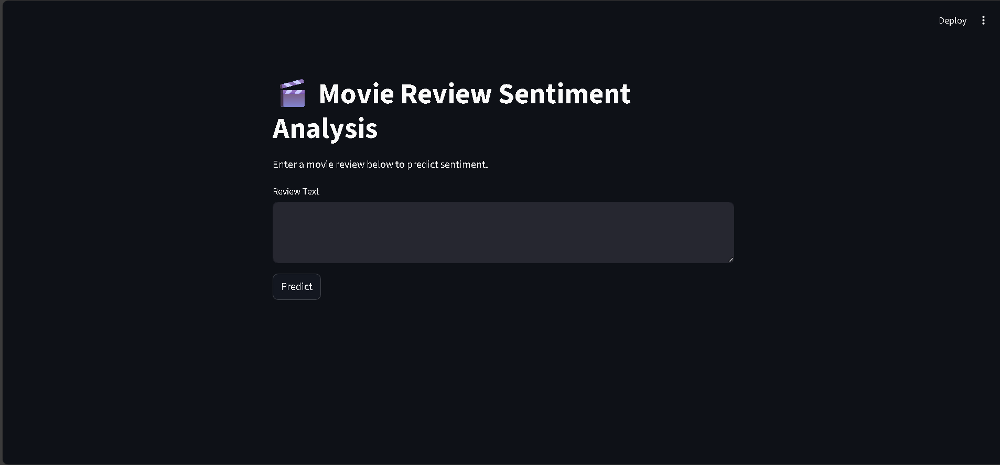
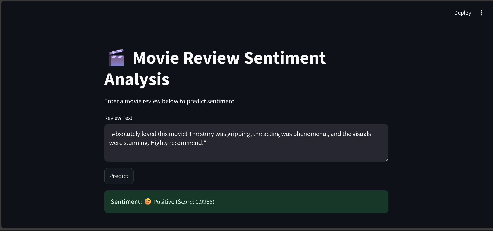
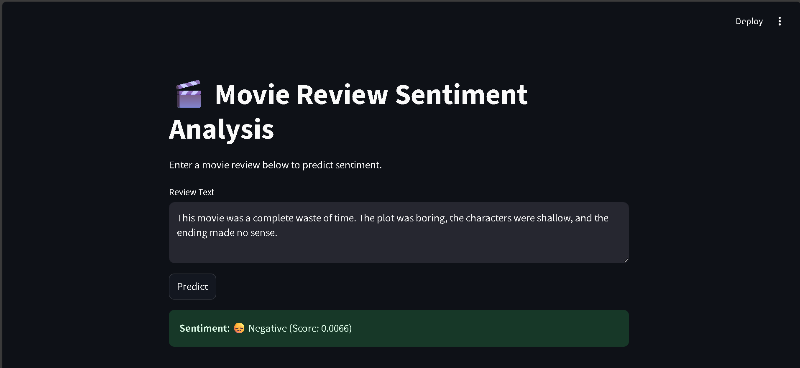

# IMDB Movie Review Sentiment Analysis

This project implements sentiment analysis on IMDB movie reviews using various machine learning and deep learning approaches. The system analyzes movie reviews and classifies them as either positive or negative.

🚀 **Try it out**: [Live Demo](https://garvitmoviereview.streamlit.app/)

## Project Overview

The project uses the IMDB dataset containing 50,000 movie reviews labeled as positive or negative. We've implemented multiple models and compared their performances to find the best approach for sentiment classification.

## Project Structure

```
├── Analysis/
│   ├── analysis.ipynb        # Jupyter notebook containing all analysis and model training
│   ├── best_model.pkl        # Saved Linear SVM model
│   ├── lstm_w2v_model.keras  # Saved LSTM model with Word2Vec embeddings
│   ├── tokenizer.pkl         # Saved tokenizer for LSTM model
│   └── word2vec.model        # Trained Word2Vec model
├── App/
│   └── app.py               # Streamlit web application
├── dataset/
│   └── IMDB Dataset.csv     # IMDB movie reviews dataset
└── requirements.txt         # Project dependencies
```

## Data Preprocessing

1. Text cleaning:
   - Conversion to lowercase
   - Removal of HTML tags
   - Removal of special characters
   - Removal of stopwords
   - Tokenization using spaCy

2. Feature extraction methods:
   - Bag of Words (BoW)
   - TF-IDF
   - Word2Vec embeddings

## Models and Performance

### Traditional Machine Learning Models (TF-IDF Features)

Model performance on test set:

| Model | Accuracy |
|-------|----------|
| Logistic Regression | 0.8963 |
| Naive Bayes | 0.8651 |
| Linear SVM | 0.8982 |
| KNN | 0.7234 |
| Random Forest | 0.8544 |
| Gradient Boosting | 0.8677 |
| AdaBoost | 0.8456 |

### Word2Vec with Linear SVM
- Accuracy: 0.8734
- Used custom word embeddings trained on the IMDB dataset
- Vector size: 100
- Window size: 5

### LSTM with Word2Vec Embeddings
- Architecture:
  - Embedding layer (pretrained Word2Vec)
  - LSTM layer (128 units)
  - Dropout (0.3)
  - Dense layer (64 units, ReLU)
  - Dropout (0.3)
  - Output layer (Sigmoid)
- Performance metrics:
  ```
  Accuracy: 0.8821
  Precision: 0.89
  Recall: 0.87
  F1-score: 0.88
  ```

## Setup and Installation

1. Clone the repository:
```bash
git clone https://github.com/garvit-010/IMDB-Movie-Review-Sentiment-Analysis.git
cd IMDB-Movie-Review-Sentiment-Analysis
```

2. Install dependencies:
```bash
pip install -r requirements.txt
python -m spacy download en_core_web_sm
```

3. Run the Streamlit app:
```bash
cd App
streamlit run app.py
```

## Model Training

To retrain the models:
1. Open the `Analysis/analysis.ipynb` notebook
2. Run all cells sequentially
3. Models will be automatically saved in the Analysis directory

## Web Application

The project includes a Streamlit web application that allows users to input movie reviews and get real-time sentiment predictions. The application is live and can be accessed at:

🌐 **[https://garvitmoviereview.streamlit.app/](https://garvitmoviereview.streamlit.app/)**

Here are some screenshots of the application in action:

### Main Interface


### Positive Review Example


### Negative Review Example


The web application features:
- Clean and intuitive user interface
- Real-time sentiment prediction
- Confidence scores for predictions
- Support for long-form movie reviews

## Future Improvements

- Implement BERT or other transformer-based models
- Add multi-class sentiment analysis (positive, neutral, negative)
- Include aspect-based sentiment analysis
- Enhance the web interface with additional features

## Acknowledgments

- IMDB for providing the dataset
- Various open-source libraries used in this project